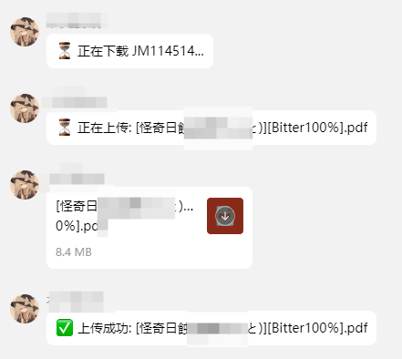

<div align="center">

# nonebot_plugin_jmgetput
一款基于NoneBot2和JMComic-Crawler-Python的插件，用来上传文件到qq群

A plugin based on NoneBot2 and JMComic-Crawler-Python to upload jmcomic files or files in qq group
</div>

基于 
[NoneBot2](https://github.com/nonebot/nonebot2)  
https://github.com/Yuelioi/nonebot-plugin-backup  
https://github.com/hect0x7/JMComic-Crawler-Python  
的插件，来上传QQ群文件，同时集成了jm指令，用来下载jm中的资源并发送到QQ群聊中

## 用途

上传QQ群文件

访问jm

下载jm文件

将jm文件发送到QQ群中

## 用法
修改download.yml中的路径，并配置config.yml
安装该插件
```
pip install .
```
通过/上传群文件 path/to/file，上传文件到qq群，要修改代码中路径的位置
通过在群聊中发送/jm xxxxxx指令，来下载对应的文件

## [1.0.6] - 2025-03-26
### Added
- 新增配置文件动态加载功能

## 计划与打算
本项目为边学边写，仓促的实现了几个功能，项目中还有许多不足。  
在接下来的更新中会继续改进不足、优化代码、添加新的功能。  
本人代码经验很少，希望大佬能够提供宝贵的建议，第一次编写项目程序  
=======
目前打算在v1.0.6中，更新混乱的路径问题，包括下载目录和上传目录

## 效果图

>>>>>>> 84a8e044b3c6e8f1adf031752449b97ea0f2dccb
